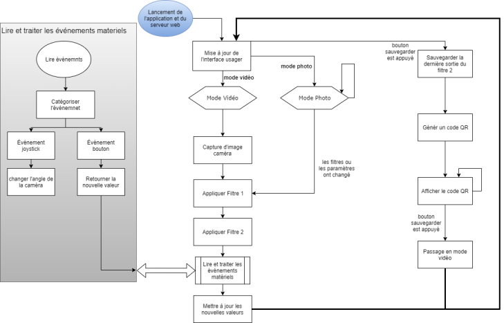

# Projet JPO

This README contains necessary information to recreate the JPO project on a brand new raspberry pi.  

Content:
- [Installation](#Installation)
  - [Operating System](#OS-Configuration)
  - [Wifi Setup](#WiFi-configuration-for-eduroam)
  - [Debian Packages](#Debian-Packages)
  - [Python Packages](#Python-Packages)
  - [Automatic Startup](#Application-Startup-at-Boot)
  - [Encryption](#Encryption)
- [Execution](#Execution)
  - [How it Works](#How-it-works)
- [Restore from Backup](#Restore-from-Backup)

# Installation

## Manual Steps

### OS Configuration
Download [raspbian](https://www.raspberrypi.org/downloads/) and flash on microSD:

### WiFi Sonfiguration For Eduroam:
Follow SI [instructions](http://si-reseau.polymtl.ca/armbian.html) to connect to eduroam on your device:

**Note**: The JPO app currently uses port 9999 for HTTPS communication.

## Automatic Steps 

The *setup* script in this repository can be used to automate this part.

### Debian Packages  
Install the necessary raspbian packages:  
`sudo apt-get install python3 python3-dev python3-pip`  
`sudo apt-get install -y libatlas-base-dev libjasper-dev libqtgui4 libqt4-test python-smbus i2c-tools`

### Python Packages
Install the necessary python3 package:  
`sudo pip3 install "numpy==1.16.2" "six==1.12.0" "Cython==0.29.14" "Pillow==2.2.2"`  
`sudo pip3 install "evdev==1.1.2" "PySimpleGui==4.4.1" "PySimpleGUIQt==0.28.0" "opencv-python==3.4.3.18" "qrcode==6.1"`  
`sudo pip3 install "adafruit-circuitpython-servokit==1.1.0"`

### Application Startup at Boot
Append the repository's *jpo-startup* script to ~/.profile:  
`echo "cd /path/to/the/repo && ./jpo-startup &" >> ~/.profile`

### Encryption
Since this project is to be used in the context of Polytechnique open house, any sensible information must be encrypted to avoid breaches.  

# 
1. Install the encryption dependencies:  
`sudo apt install ecryptfs-utils cryptsetup`
#### **xxxx** and  **piuser** need to be replaced by whatever credential is used on the new raspberry pi.
2. Create a new user called **xxxx** and follow the creation instruction.  
`sudo adduser tempuser`
3. Give **xxxx** sudo rights  
`sudo usermod -aG sudo tempuser`
4. Disable auto-login in the raspbian configuration window, accessible from the application launcher
5. Reboot  
`sudo reboot`
6. login as **xxxx** 
7. Kill all sessions opened by user **piuser**. If a single single session belonging to user **piuser** remains open, the encryption will fail.  
`sudo pkill -9 -u piuser`
8. Migrate the pi home directory to an encrypted partition. Make sure you use the password that **piuser** has set when prompted.  
`sudo ecryptfs-migrate-home -u piuser`
9. Logout and login using the **piuser** user credentials. ***Do not reboot!***
10. Run the following command and store the recovery password somewhere safe (outside of the encrypted machine).  
`ecryptfs-unwrap-passphrase`
11. Reboot and login as user **piuser**.  
`sudo reboot`
11. ***Only do this after a reboot!***   
If everything looks good, you can safely remove the **tempuser** as well as the backup created in the `/home/` directory. If you can't remember the backup name, run `ls /home`, and one of the listed folders should be a user name followed by a dot and some numbers and letters (like **pi.4xVQvCsO**) - that's the backup.
`sudo rm -rf  /home/pi.4xVQvCsO`  
`sudo userdel -r tempuser && rm -rf /home/xxxx`

For more information, please read the following tutorial: https://www.linuxuprising.com/2018/04/how-to-encrypt-home-folder-in-ubuntu.html

# Execution

The project is split in two separate applications:
- The *jpo* application uses the hardware peripherals to take pictures and modify them.  
- The *webserver* application exposes these pictures and handles user traffic to share them.  

Both are executable python3 scripts. To launch them, you can use:
- `./jpo`
- `./webserver`

However, since this project has to be used by non "tech-savy" people, it must run on its own. The *jpo-startup* shell script mentionned above starts both these applications.  
This startup script also restarts these applications on crash. This script will execute on boot if the [previous step](#Application-startup-at-boot) about boot startup was followed.  

## How it works

Below is a state diagram that shows the inner workings of the project:

  

To operate this state machine, users can use the project dedicated hardware. The interface tutorial can be found [here](Documentation/tutoriel/tutoriel.pdf).

### Restore from Backup
A different way to install the system is to use the backup image available at the link below and copy the whole content to a SD card. The SD card **MUST be at least 32 Gb in size**. 
It is possible to restore the system on an SD card smaller than 32GB (using Gparted or other partitioning tools), but it is beyond the scope of this readme.

1. Find the device under which is situated your SD card.   
`lsblk`  
You will recognize the card by looking at the size available listed for each device.    
2. Download the image from the following link:  
https://partage.gi.polymtl.ca/index.php/s/tqJGtnLJzjp7bQn  
password: **jpo-polymtl**
3.  Once you have identified your device and downloaded the backup image, all you need is to run the following command. The command takes a while...   
(*you will need sudo privileges to the machine on which you are running this command*) 
    ---
    **MAKE SURE YOU PUT THE RIGHT DEVICE UNDER "of=/dev/sdX" (SEE STEP 1 FOR MORE INFORMATION)**  
    **THIS IS A DESTRUCTIVE OPERATION, ALL THE CONTENTS ON THE OUTPUT DEVICE WILL BE WIPED AND REPLACED WITH THE CONTENT OF THE BACKUP IMAGE. MAKE SURE YOU SELECT THE RIGHT DEVICE**
    ---   
    `gzip -dc /path/to/your/image/image021219.gz | sudo dd bs=4M of=/dev/sdX`  

EXTRA: to make a new image backup, insert the sd card into your computer, find its location using `lsblk` and then copy its contents with the following command. It takes a while...  
```sudo dd bs=4M if=/dev/sdb | gzip > image`date +%d%m%y`.gz```